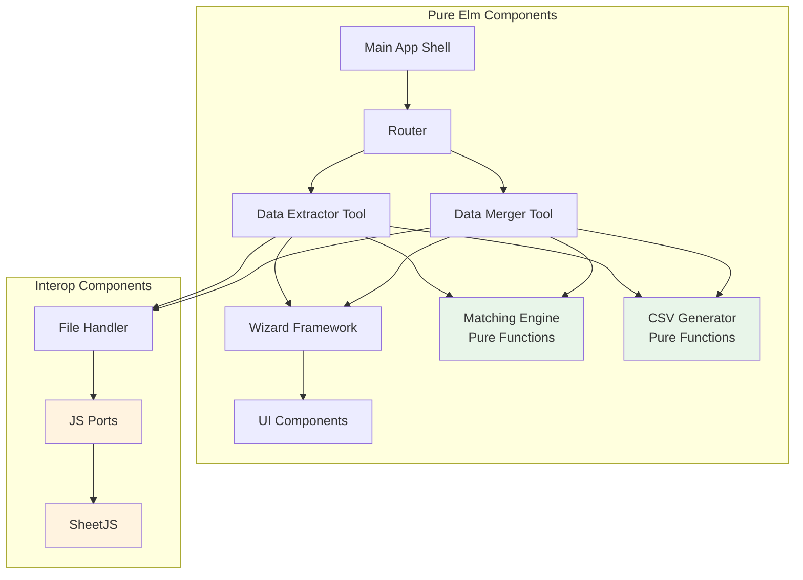

# Components

## Main Application Shell
**Responsibility:** Root application container managing routing, global state, and top-level application lifecycle

**Key Interfaces:**
- Route management (Home, DataExtractor, DataMerger, NotFound)
- Global error boundary
- Browser compatibility checking
- Desktop-only enforcement (1024px minimum)

**Dependencies:** All tool modules, shared components, router

**Technology Stack:** Pure Elm with Model-View-Update architecture

## Wizard Framework
**Responsibility:** Reusable multi-step workflow engine providing consistent UX across all tools

**Key Interfaces:**
- Generic step progression with validation
- Step state persistence during navigation
- Progress indicator management
- Navigation control (Next/Previous/Start Over)

**Dependencies:** UI components for rendering

**Technology Stack:** Generic Elm module with polymorphic types for flexibility

## File Handler Component
**Responsibility:** Manages file upload, validation, and parsing through JavaScript interop

**Key Interfaces:**
- Drag-and-drop file upload
- File type validation (.xlsx, .xls, .csv)
- Size validation (50MB limit)
- Port communication with SheetJS

**Dependencies:** JavaScript interop ports, SheetJS library

**Technology Stack:** Elm component with JavaScript ports for file parsing

## Matching Engine
**Responsibility:** Pure functional engine for all data matching operations

**Key Interfaces:**
- exactMatch : String -> String -> Bool
- fuzzyMatch : Float -> String -> String -> Bool  
- matchRows : MatchConfig -> List (List String) -> List (List String) -> ProcessedData
- scoreSimilarity : String -> String -> Float

**Dependencies:** None (pure functions)

**Technology Stack:** Pure Elm functions, no side effects

## CSV Generator
**Responsibility:** Pure functional transformation of processed data to CSV format

**Key Interfaces:**
- generateCSV : List String -> List (List String) -> String
- escapeCSVField : String -> String
- addTildePrefix : List (List String) -> List (List String)

**Dependencies:** None (pure functions)

**Technology Stack:** Pure Elm functions for data transformation

## Data Extractor Tool
**Responsibility:** Complete tool implementation for extracting matching records between spreadsheets

**Key Interfaces:**
- Five-step wizard workflow
- Dual file upload (master/data)
- Multi-column matching configuration
- Field selection for output
- CSV download of matches

**Dependencies:** Wizard Framework, File Handler, Matching Engine, CSV Generator

**Technology Stack:** Elm module following MVU pattern

## Data Merger Tool  
**Responsibility:** Complete tool implementation for merging two spreadsheets with conflict resolution

**Key Interfaces:**
- Five-step wizard workflow
- Dual file upload (A/B spreadsheets)
- Merge configuration with conflict strategy
- Tilde prefix for deleted records
- CSV download of merged data

**Dependencies:** Wizard Framework, File Handler, Matching Engine, CSV Generator

**Technology Stack:** Elm module following MVU pattern

## UI Component Library
**Responsibility:** Reusable visual components following design system

**Key Interfaces:**
- Button (primary, secondary, disabled states)
- Card (tool cards with hover effects)
- Form elements (inputs, checkboxes, selects)
- Progress indicators (bar and step indicators)
- Error/success messages
- Loading states

**Dependencies:** CSS styles (BEM methodology)

**Technology Stack:** Pure Elm view functions with CSS classes

## Component Interaction Diagram

