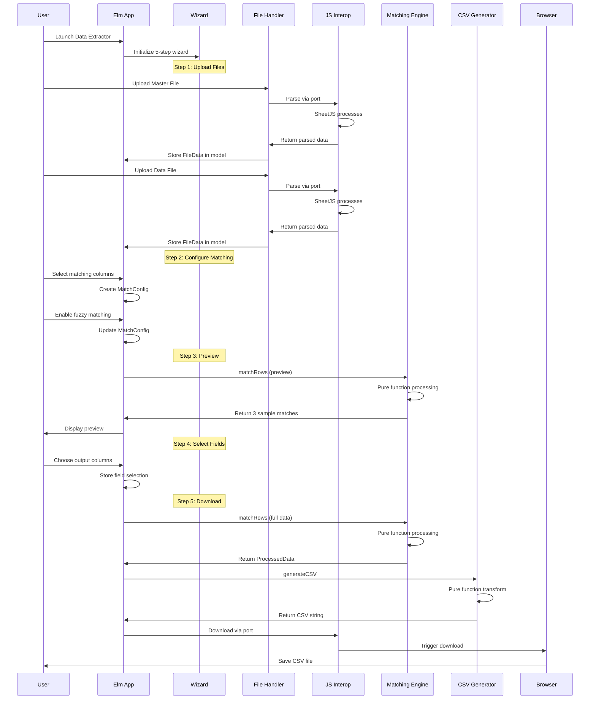
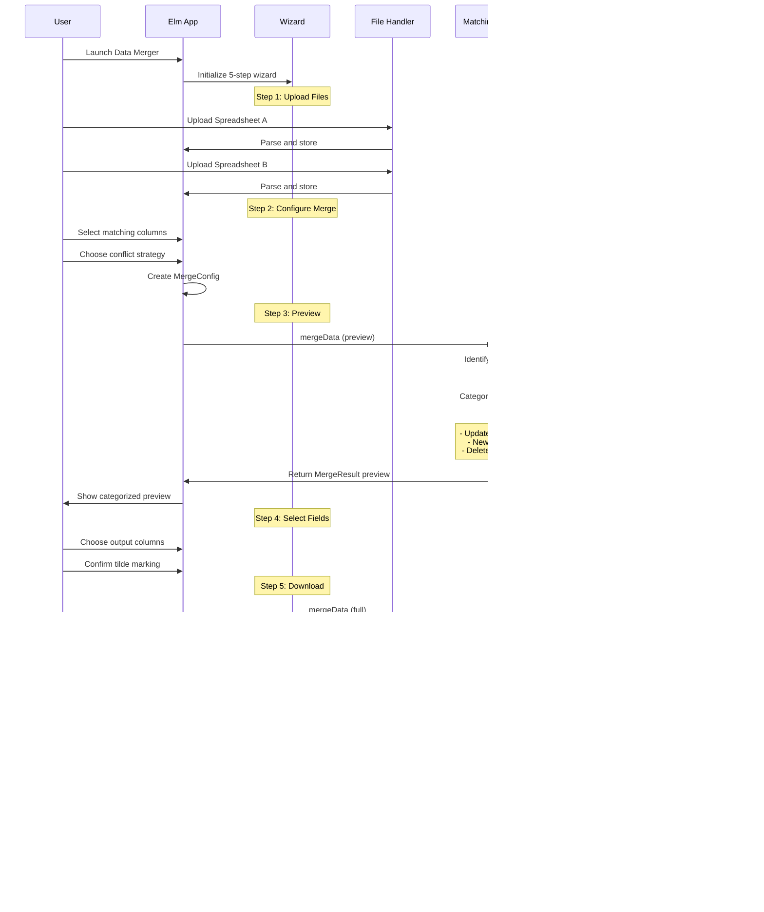
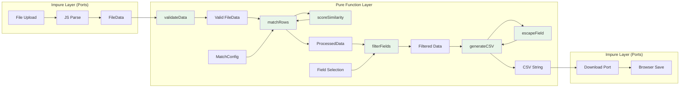

# Core Workflows

## Data Extractor Workflow

```mermaid
sequenceDiagram
    participant U as User
    participant E as Elm App
    participant W as Wizard
    participant F as File Handler
    participant JS as JS Interop
    participant M as Matching Engine
    participant C as CSV Generator
    participant B as Browser

    U->>E: Launch Data Extractor
    E->>W: Initialize 5-step wizard
    
    Note over W: Step 1: Upload Files
    U->>F: Upload Master File
    F->>JS: Parse via port
    JS->>JS: SheetJS processes
    JS->>F: Return parsed data
    F->>E: Store FileData in model
    
    U->>F: Upload Data File
    F->>JS: Parse via port
    JS->>JS: SheetJS processes
    JS->>F: Return parsed data
    F->>E: Store FileData in model
    
    Note over W: Step 2: Configure Matching
    U->>E: Select matching columns
    E->>E: Create MatchConfig
    U->>E: Enable fuzzy matching
    E->>E: Update MatchConfig
    
    Note over W: Step 3: Preview
    E->>M: matchRows (preview)
    M->>M: Pure function processing
    M->>E: Return 3 sample matches
    E->>U: Display preview
    
    Note over W: Step 4: Select Fields
    U->>E: Choose output columns
    E->>E: Store field selection
    
    Note over W: Step 5: Download
    E->>M: matchRows (full data)
    M->>M: Pure function processing
    M->>E: Return ProcessedData
    E->>C: generateCSV
    C->>C: Pure function transform
    C->>E: Return CSV string
    E->>JS: Download via port
    JS->>B: Trigger download
    B->>U: Save CSV file
```

## Data Merger Workflow

```mermaid
sequenceDiagram
    participant U as User
    participant E as Elm App
    participant W as Wizard
    participant F as File Handler
    participant M as Matching Engine
    participant C as CSV Generator
    participant B as Browser

    U->>E: Launch Data Merger
    E->>W: Initialize 5-step wizard
    
    Note over W: Step 1: Upload Files
    U->>F: Upload Spreadsheet A
    F->>E: Parse and store
    U->>F: Upload Spreadsheet B  
    F->>E: Parse and store
    
    Note over W: Step 2: Configure Merge
    U->>E: Select matching columns
    U->>E: Choose conflict strategy
    E->>E: Create MergeConfig
    
    Note over W: Step 3: Preview
    E->>M: mergeData (preview)
    M->>M: Identify matches
    M->>M: Categorize records
    Note over M: - Updated (in both)<br/>- New (A only)<br/>- Deleted (B only)
    M->>E: Return MergeResult preview
    E->>U: Show categorized preview
    
    Note over W: Step 4: Select Fields
    U->>E: Choose output columns
    U->>E: Confirm tilde marking
    
    Note over W: Step 5: Download
    E->>M: mergeData (full)
    M->>M: Process all records
    M->>M: Add ~ prefix to deleted
    M->>E: Return MergeResult
    E->>C: generateMergedCSV
    C->>C: Format with tilde prefixes
    C->>E: Return CSV string
    E->>B: Download file
    U->>U: Filter in Excel
```

## Pure Function Data Flow

```mermaid
flowchart LR
    subgraph "Impure Layer (Ports)"
        A[File Upload] --> B[JS Parse]
        B --> C[FileData]
    end
    
    subgraph "Pure Function Layer"
        C --> D[validateData]
        D --> E[Valid FileData]
        E --> F[matchRows]
        
        G[MatchConfig] --> F
        
        F --> H[scoreSimilarity]
        H --> F
        F --> I[ProcessedData]
        
        I --> J[filterFields]
        K[Field Selection] --> J
        J --> L[Filtered Data]
        
        L --> M[generateCSV]
        M --> N[escapeField]
        N --> M
        M --> O[CSV String]
    end
    
    subgraph "Impure Layer (Ports)"
        O --> P[Download Port]
        P --> Q[Browser Save]
    end
    
    style D fill:#e8f5e9
    style F fill:#e8f5e9
    style H fill:#e8f5e9
    style J fill:#e8f5e9
    style M fill:#e8f5e9
    style N fill:#e8f5e9
```
