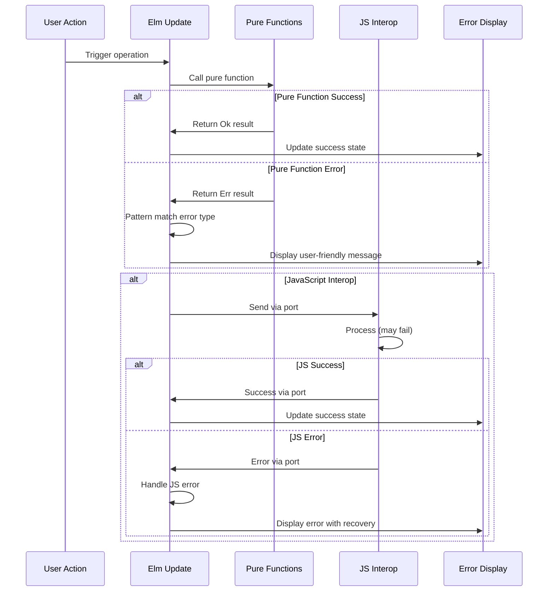

# Error Handling Strategy

## Error Flow



## Error Response Format

```elm
-- Unified error type system
type AppError
    = UserError UserErrorType String
    | SystemError SystemErrorType String
    | ValidationError (List ValidationMessage)
    | JavaScriptError JSErrorType String

type UserErrorType
    = InvalidFileFormat
    | FileSizeExceeded
    | NoMatchesFound
    | InsufficientData
    | UnsupportedOperation

type SystemErrorType
    = OutOfMemory
    | BrowserNotSupported
    | ProcessingTimeout
    | UnexpectedError

type JSErrorType
    = FileParsingFailed
    | DownloadFailed
    | BrowserAPIUnavailable

type alias ValidationMessage =
    { field : String
    , message : String
    , suggestion : Maybe String
    }

-- Error response structure for consistency
type alias ErrorResponse =
    { error : AppError
    , timestamp : Float
    , context : ErrorContext
    , recoveryActions : List RecoveryAction
    }

type alias ErrorContext =
    { currentStep : String
    , fileInfo : Maybe String
    , operationType : String
    }

type RecoveryAction
    = RetryOperation
    | ClearData
    | ChangeSettings
    | ContactSupport
```

## Frontend Error Handling

```elm
-- Comprehensive error handling in update function
handleError : AppError -> Model -> ( Model, Cmd Msg )
handleError error model =
    let
        errorResponse = createErrorResponse error model
        
        ( updatedModel, recoveryCmd ) = 
            case error of
                UserError InvalidFileFormat message ->
                    ( { model | errorState = Just errorResponse, showFileHelp = True }
                    , showFileFormatGuidance
                    )
                
                UserError FileSizeExceeded message ->
                    ( { model | errorState = Just errorResponse }
                    , showFileSizeGuidance
                    )
                
                UserError NoMatchesFound message ->
                    ( { model | errorState = Just errorResponse, showMatchingHelp = True }
                    , showMatchingGuidance
                    )
                
                SystemError OutOfMemory message ->
                    ( clearLargeData { model | errorState = Just errorResponse }
                    , Cmd.batch
                        [ clearBrowserMemory ()
                        , showMemoryGuidance
                        ]
                    )
                
                SystemError ProcessingTimeout message ->
                    ( { model | errorState = Just errorResponse }
                    , showPerformanceGuidance
                    )
                
                ValidationError messages ->
                    ( { model 
                        | errorState = Just errorResponse
                        , validationErrors = messages
                      }
                    , focusFirstInvalidField messages
                    )
                
                JavaScriptError FileParsingFailed message ->
                    ( { model | errorState = Just errorResponse }
                    , Cmd.batch
                        [ suggestFileRepair
                        , offerAlternativeFormats
                        ]
                    )
    in
    ( updatedModel, recoveryCmd )
```

## Backend Error Handling

**N/A - No Backend**

This application has no backend, so there are no server-side error handling patterns needed. All error handling occurs in the browser through Elm's type system and JavaScript interop error boundaries.
