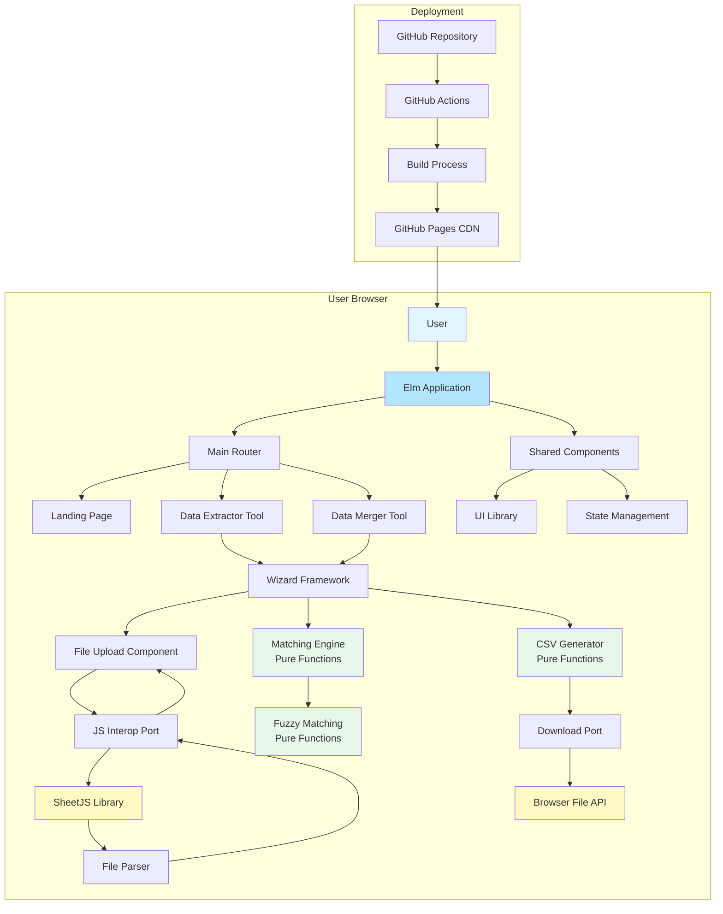

# High Level Architecture

## Technical Summary

The Spreadsheet Data Platform is a client-side only web application built with Elm Lang that provides privacy-focused data manipulation tools through a modular plugin architecture. The application uses Elm's Model-View-Update architecture for robust state management, JavaScript interop via ports for file handling with SheetJS, and a wizard-driven UI pattern for guiding users through complex workflows. Deployment utilizes GitHub Pages for static hosting with GitHub Actions CI/CD, ensuring zero server infrastructure while maintaining professional deployment practices. This architecture achieves the PRD goals of absolute privacy (100% browser processing), extensibility (plugin architecture for new tools), and user-friendliness (wizard-driven workflows) while maintaining type safety through Elm's compiler guarantees.

## Platform and Infrastructure Choice

**Platform:** GitHub Pages (Static Hosting)  
**Key Services:** GitHub Actions (CI/CD), GitHub Pages (Hosting), CDN (GitHub's built-in)  
**Deployment Host and Regions:** GitHub Pages global CDN, no specific region configuration needed

## Repository Structure

**Structure:** Monorepo  
**Monorepo Tool:** Not applicable (single Elm application with modular structure)  
**Package Organization:** Modular tool architecture within single Elm application, shared components in `src/Shared/` directory

## High Level Architecture Diagram

## Architectural Patterns

- **Pure Functions First:** All data transformations, matching algorithms, and business logic implemented as pure functions - _Rationale:_ Ensures testability, predictability, and eliminates side effects for reliable data processing
- **Model-View-Update (MVU):** Elm's functional reactive architecture for predictable state management - _Rationale:_ Enforced by Elm, provides excellent reliability and debugging
- **Immutable State:** Functional programming with immutable data structures - _Rationale:_ Prevents bugs, enables time-travel debugging, complements pure functions
- **Wizard Pattern:** Step-by-step guided workflows for complex operations - _Rationale:_ Reduces cognitive load for non-technical users processing data
- **Plugin Architecture:** Modular tool design with shared components - _Rationale:_ Enables adding new tools with less than 1 week development effort per PRD
- **Ports Pattern:** Controlled JavaScript interop boundaries - _Rationale:_ Maintains Elm's type safety while isolating impure operations
- **Component-Based UI:** Reusable UI components with BEM CSS methodology - _Rationale:_ Ensures consistent design and maintainable styling per Front-End Spec
- **Client-Side Only Processing:** All computation in browser, no server calls - _Rationale:_ Absolute privacy guarantee, core differentiator
- **Progressive Disclosure:** Complex features revealed progressively through wizard - _Rationale:_ Enables 80% of users to complete first operation without documentation
- **Functional Composition:** Build complex operations by composing simple pure functions - _Rationale:_ Improves code reuse and maintainability
