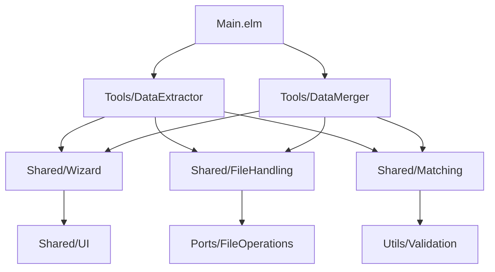
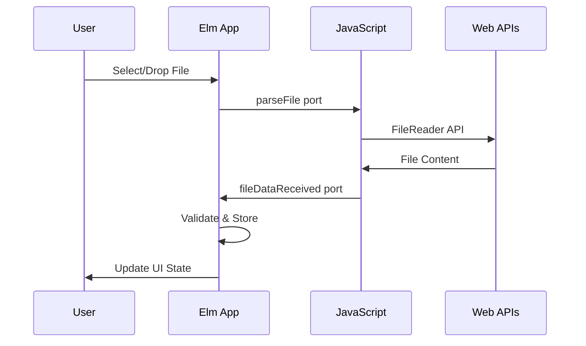
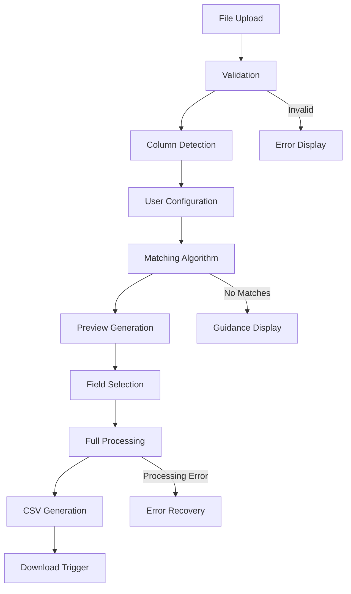
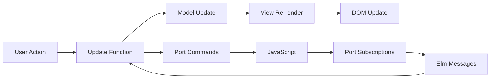

# Front-End Specification
## Spreadsheet Data Tools Platform

### Document Information
| Field | Value |
|-------|-------|
| Version | 1.0 |
| Date | 2025-08-21 |
| Status | Draft |
| Authors | Development Team |

---

## Table of Contents

1. [Executive Summary](#executive-summary)
2. [Architecture Overview](#architecture-overview)
3. [Elm Model-View-Update Architecture](#elm-model-view-update-architecture)
4. [State Management Specifications](#state-management-specifications)
5. [Data Flow Diagrams](#data-flow-diagrams)
6. [JavaScript Interop Specifications](#javascript-interop-specifications)
7. [CSS Architecture and Naming Conventions](#css-architecture-and-naming-conventions)
8. [Component Library](#component-library)
9. [Performance Requirements](#performance-requirements)
10. [Browser Compatibility](#browser-compatibility)
11. [Testing Strategy](#testing-strategy)
12. [Error Handling and User Feedback](#error-handling-and-user-feedback)
13. [Build and Deployment](#build-and-deployment)
14. [Development Guidelines](#development-guidelines)

---

## Executive Summary

The Spreadsheet Data Tools platform is a privacy-first, desktop-only web application built with Elm that provides specialized tools for comparing, extracting, and merging data between spreadsheets. This specification outlines the front-end architecture, component design, and implementation patterns required to deliver a production-ready platform that processes files up to 50MB entirely in the user's browser on desktop computers.

**Key Architectural Principles:**
- **Desktop-Only**: Exclusively designed for desktop browsers (minimum 1024px width)
- **Privacy-First**: 100% client-side processing with zero data transmission
- **Type Safety**: Elm's type system prevents runtime errors and ensures reliability
- **Modular Design**: Plugin architecture enabling new tools with minimal development effort
- **Performance**: Optimized for large file processing within browser constraints

---

## Architecture Overview

### Application Structure
```
src/
├── Main.elm                 # Application entry point and routing
├── Types/                   # Shared type definitions
│   ├── Common.elm          # Common types (FileData, MatchConfig, etc.)
│   ├── DataExtractor.elm   # Data Extractor specific types
│   └── DataMerger.elm      # Data Merger specific types
├── Shared/                 # Shared modules across tools
│   ├── Wizard/             # Generic wizard framework
│   │   ├── Types.elm       # Wizard types and states
│   │   ├── View.elm        # Wizard UI components
│   │   └── Update.elm      # Wizard state transitions
│   ├── FileHandling/       # File processing utilities
│   │   ├── Upload.elm      # File upload logic
│   │   ├── Parser.elm      # File parsing (via ports)
│   │   └── Download.elm    # CSV generation and download
│   ├── Matching/           # Data matching algorithms
│   │   ├── Types.elm       # Matching configuration types
│   │   ├── Fuzzy.elm       # Fuzzy matching algorithms
│   │   └── Engine.elm      # Core matching engine
│   └── UI/                 # Shared UI components
│       ├── Button.elm      # Button components
│       ├── Card.elm        # Card components
│       ├── Form.elm        # Form elements
│       └── Progress.elm    # Progress indicators
├── Tools/                  # Individual tool implementations
│   ├── DataExtractor/      # Data Extractor tool
│   │   ├── Types.elm       # Tool-specific types
│   │   ├── Model.elm       # Tool state and model
│   │   ├── View.elm        # Tool UI rendering
│   │   ├── Update.elm      # Tool update logic
│   │   └── Subscriptions.elm # Tool subscriptions
│   └── DataMerger/         # Data Merger tool (similar structure)
├── Ports/                  # JavaScript interop definitions
│   ├── FileOperations.elm  # File parsing and download ports
│   └── Analytics.elm       # Privacy-respecting analytics ports
└── Utils/                  # Utility functions
    ├── Validation.elm      # Input validation
    ├── Formatting.elm      # Data formatting utilities
    └── Constants.elm       # Application constants
```

### Module Dependencies


---

## Elm Model-View-Update Architecture

### Global Application Model
```elm
type alias Model =
    { route : Route
    , shared : SharedState
    , toolState : ToolState
    }

type Route
    = Home
    | DataExtractorRoute DataExtractor.Model
    | DataMergerRoute DataMerger.Model
    | NotFound

type alias SharedState =
    { windowSize : { width : Int, height : Int }
    , privacyMode : Bool
    , errorState : Maybe AppError
    }

type ToolState
    = NoTool
    | ExtractorTool DataExtractor.Model
    | MergerTool DataMerger.Model
```

### Tool-Specific Model Pattern
```elm
-- Example: DataExtractor/Types.elm
type alias Model =
    { wizard : Wizard.Model WizardStep
    , fileData : FileData
    , matchingConfig : Maybe MatchConfig
    , previewResults : Maybe PreviewData
    , selectedFields : Set String
    , processingState : ProcessingState
    }

type WizardStep
    = Upload
    | Configure
    | Preview
    | SelectFields
    | Download

type ProcessingState
    = Idle
    | Processing Float -- Progress percentage
    | Completed DownloadInfo
    | Failed String
```

### Update Message Pattern
```elm
-- Tool-specific messages
type Msg
    = WizardMsg Wizard.Msg
    | FileUploaded String FileContent
    | MatchingConfigUpdated MatchConfig
    | PreviewGenerated (Result String PreviewData)
    | FieldSelectionChanged String Bool
    | ProcessingStarted
    | ProcessingProgress Float
    | ProcessingCompleted DownloadInfo
    | ClearAllData
    | StartOver

-- Update function structure
update : Msg -> Model -> ( Model, Cmd Msg )
update msg model =
    case msg of
        WizardMsg wizardMsg ->
            Wizard.update wizardMsg model.wizard
                |> Tuple.mapFirst (\w -> { model | wizard = w })
                |> Tuple.mapSecond (Cmd.map WizardMsg)
        
        FileUploaded fileType content ->
            updateFileData fileType content model
        
        -- Additional message handlers...
```

### View Architecture
```elm
-- Main view composition
view : Model -> Html Msg
view model =
    div [ class "app" ]
        [ header [] [ viewHeader model.shared ]
        , main_ [] [ viewCurrentRoute model ]
        , footer [] [ viewFooter ]
        ]

-- Tool view pattern
viewTool : Model -> Html Msg
viewTool model =
    div [ class "tool-container" ]
        [ Wizard.view wizardConfig model.wizard
            |> Html.map WizardMsg
        ]

wizardConfig : Wizard.Config WizardStep Msg
wizardConfig =
    { stepView = viewStep
    , stepValidation = validateStep
    , navigationConfig = navConfig
    }
```

---

## State Management Specifications

### Wizard State Management
The wizard framework provides consistent state management across all tools:

```elm
-- Shared/Wizard/Types.elm
type alias Model step =
    { currentStep : step
    , completedSteps : Set step
    , stepData : Dict step StepData
    , navigationState : NavigationState
    }

type NavigationState
    = CanNavigate { canGoBack : Bool, canGoForward : Bool }
    | Processing
    | Disabled String -- Reason

-- Step validation pattern
type StepValidation
    = Valid
    | Invalid (List String) -- Error messages
    | Pending -- Async validation in progress
```

### File Processing State
```elm
-- File upload and processing states
type FileState
    = NoFile
    | Uploading Float -- Progress percentage
    | Uploaded FileInfo
    | Processing ProcessingStep Float
    | Processed ProcessedData
    | Failed FileError

type ProcessingStep
    = Parsing
    | Validating
    | Analyzing

type alias FileInfo =
    { name : String
    , size : Int
    , type_ : String
    , lastModified : Int
    }
```

### Data Persistence Strategy
Since the application maintains privacy by avoiding localStorage/sessionStorage:

1. **Session Memory Only**: All data stored in Elm model during session
2. **No Persistence**: Data cleared on page refresh (by design)
3. **Clear Data Function**: Explicit user action to clear memory
4. **Memory Management**: Automatic cleanup of large objects when not needed

---

## Data Flow Diagrams

### File Upload Flow


### Data Processing Flow


### State Synchronization


---

## JavaScript Interop Specifications

### Port Definitions
```elm
-- Ports/FileOperations.elm
port parseFile : FileUploadRequest -> Cmd msg
port fileDataReceived : (FileParseResult -> msg) -> Sub msg
port generateCSV : CSVGenerationRequest -> Cmd msg
port downloadReady : (DownloadInfo -> msg) -> Sub msg
port clearBrowserMemory : () -> Cmd msg

-- Type definitions for port communication
type alias FileUploadRequest =
    { fileId : String
    , fileType : String
    , content : String -- Base64 or ArrayBuffer reference
    }

type alias FileParseResult =
    { fileId : String
    , success : Bool
    , data : Maybe ParsedData
    , error : Maybe String
    }

type alias ParsedData =
    { headers : List String
    , rows : List (List String)
    , metadata : FileMetadata
    }
```

### JavaScript Implementation
```javascript
// File parsing with SheetJS
app.ports.parseFile.subscribe(function(request) {
    try {
        const workbook = XLSX.read(request.content, { type: 'binary' });
        const firstSheet = workbook.Sheets[workbook.SheetNames[0]];
        const data = XLSX.utils.sheet_to_json(firstSheet, { header: 1 });
        
        const headers = data[0] || [];
        const rows = data.slice(1);
        
        app.ports.fileDataReceived.send({
            fileId: request.fileId,
            success: true,
            data: {
                headers: headers,
                rows: rows,
                metadata: {
                    sheetCount: workbook.SheetNames.length,
                    rowCount: rows.length,
                    columnCount: headers.length
                }
            },
            error: null
        });
    } catch (error) {
        app.ports.fileDataReceived.send({
            fileId: request.fileId,
            success: false,
            data: null,
            error: error.message
        });
    }
});

// CSV download implementation
app.ports.generateCSV.subscribe(function(request) {
    try {
        const csv = generateCSVContent(request.data, request.options);
        const blob = new Blob([csv], { type: 'text/csv;charset=utf-8;' });
        const url = URL.createObjectURL(blob);
        
        app.ports.downloadReady.send({
            url: url,
            filename: request.filename,
            size: blob.size
        });
    } catch (error) {
        // Error handling
    }
});
```

### Error Handling Strategy
```elm
-- Comprehensive error types for JavaScript interop
type JavaScriptError
    = FileParsingError String
    | UnsupportedFileFormat String
    | FileSizeExceeded Int Int -- actual, maximum
    | BrowserNotSupported String
    | OutOfMemory
    | NetworkError String -- For CDN resources only

-- Error recovery patterns
handleJavaScriptError : JavaScriptError -> Model -> ( Model, Cmd Msg )
handleJavaScriptError error model =
    case error of
        FileParsingError message ->
            ( { model | errorState = Just (UserError message) }
            , Cmd.none
            )
        
        OutOfMemory ->
            ( model
            , Cmd.batch
                [ clearBrowserMemory ()
                , showMemoryWarning "File too large. Try a smaller file."
                ]
            )
```

---

## CSS Architecture and Naming Conventions

### File Organization
```
src/styles/
├── base/
│   ├── reset.css           # CSS reset and normalize
│   ├── typography.css      # Font definitions and text styles
│   └── variables.css       # CSS custom properties
├── components/
│   ├── buttons.css         # Button component styles
│   ├── cards.css          # Card component styles
│   ├── forms.css          # Form element styles
│   ├── progress.css       # Progress indicator styles
│   └── wizard.css         # Wizard framework styles
├── layout/
│   ├── header.css         # Header layout
│   ├── footer.css         # Footer layout
│   ├── grid.css           # Grid system
│   └── containers.css     # Container layouts
├── pages/
│   ├── landing.css        # Landing page specific styles
│   ├── data-extractor.css # Data Extractor tool styles
│   └── data-merger.css    # Data Merger tool styles
├── utilities/
│   ├── spacing.css        # Margin and padding utilities
│   ├── colors.css         # Color utilities
│   └── helpers.css        # Helper utilities
└── main.css               # Main import file
```

### CSS Naming Convention (BEM Methodology)
```css
/* Block - standalone component */
.tool-card { }

/* Element - part of a block */
.tool-card__icon { }
.tool-card__title { }
.tool-card__description { }
.tool-card__button { }

/* Modifier - variation of a block or element */
.tool-card--featured { }
.tool-card__button--primary { }
.tool-card__button--disabled { }

/* State classes */
.is-active { }
.is-loading { }
.is-error { }
.is-success { }
```

### CSS Custom Properties
```css
:root {
  /* Color System */
  --color-primary: #2563EB;
  --color-primary-dark: #1D4ED8;
  --color-primary-light: #DBEAFE;
  
  --color-success: #10B981;
  --color-success-light: #D1FAE5;
  --color-warning: #F59E0B;
  --color-warning-light: #FEF3C7;
  --color-error: #EF4444;
  --color-error-light: #FEE2E2;
  
  /* Neutral Scale */
  --color-gray-900: #111827;
  --color-gray-700: #374151;
  --color-gray-600: #6B7280;
  --color-gray-400: #9CA3AF;
  --color-gray-300: #E5E7EB;
  --color-gray-100: #F9FAFB;
  --color-white: #FFFFFF;
  
  /* Typography */
  --font-family-primary: Inter, -apple-system, BlinkMacSystemFont, 'Segoe UI', sans-serif;
  --font-family-mono: 'SF Mono', Monaco, 'Cascadia Code', monospace;
  
  /* Font Sizes */
  --font-size-xs: 0.75rem;   /* 12px */
  --font-size-sm: 0.875rem;  /* 14px */
  --font-size-base: 1rem;    /* 16px */
  --font-size-lg: 1.125rem;  /* 18px */
  --font-size-xl: 1.25rem;   /* 20px */
  --font-size-2xl: 1.5rem;   /* 24px */
  --font-size-3xl: 2rem;     /* 32px */
  --font-size-4xl: 2.5rem;   /* 40px */
  
  /* Spacing Scale (8px base) */
  --space-1: 0.25rem;  /* 4px */
  --space-2: 0.5rem;   /* 8px */
  --space-3: 0.75rem;  /* 12px */
  --space-4: 1rem;     /* 16px */
  --space-5: 1.25rem;  /* 20px */
  --space-6: 1.5rem;   /* 24px */
  --space-8: 2rem;     /* 32px */
  --space-10: 2.5rem;  /* 40px */
  --space-12: 3rem;    /* 48px */
  
  /* Shadows */
  --shadow-sm: 0 1px 2px rgba(0, 0, 0, 0.05);
  --shadow-base: 0 1px 3px rgba(0, 0, 0, 0.1);
  --shadow-md: 0 4px 6px rgba(0, 0, 0, 0.1);
  --shadow-lg: 0 10px 15px rgba(0, 0, 0, 0.1);
  
  /* Border Radius */
  --radius-sm: 0.25rem;  /* 4px */
  --radius-base: 0.375rem; /* 6px */
  --radius-md: 0.5rem;   /* 8px */
  --radius-lg: 0.75rem;  /* 12px */
  --radius-full: 9999px;
  
  /* Transitions */
  --transition-fast: 150ms cubic-bezier(0.4, 0, 0.2, 1);
  --transition-base: 200ms cubic-bezier(0.4, 0, 0.2, 1);
  --transition-slow: 300ms cubic-bezier(0.4, 0, 0.2, 1);
}
```

### Component Style Example
```css
/* Tool Card Component */
.tool-card {
  background: var(--color-white);
  border: 1px solid var(--color-gray-300);
  border-radius: var(--radius-md);
  box-shadow: var(--shadow-sm);
  padding: var(--space-6);
  transition: all var(--transition-base);
}

.tool-card:hover {
  box-shadow: var(--shadow-lg);
  transform: translateY(-2px);
}

.tool-card__icon {
  font-size: var(--font-size-4xl);
  margin-bottom: var(--space-4);
  display: block;
}

.tool-card__title {
  font-size: var(--font-size-xl);
  font-weight: 600;
  color: var(--color-gray-900);
  margin-bottom: var(--space-3);
}

.tool-card__description {
  color: var(--color-gray-600);
  line-height: 1.6;
  margin-bottom: var(--space-5);
}

.tool-card__button {
  width: 100%;
}
```

---

## Component Library

### Core Components

#### Button Components
```elm
-- Shared/UI/Button.elm
type ButtonVariant
    = Primary
    | Secondary
    | Danger
    | Link

type ButtonSize
    = Small
    | Medium
    | Large

type alias ButtonConfig msg =
    { variant : ButtonVariant
    , size : ButtonSize
    , disabled : Bool
    , loading : Bool
    , onClick : Maybe msg
    , attributes : List (Attribute msg)
    }

button : ButtonConfig msg -> List (Html msg) -> Html msg
button config children =
    Html.button
        [ class (buttonClasses config)
        , disabled config.disabled
        , onClick config.onClick |> Maybe.withDefault (onClick (Debug.todo "No onClick"))
        ]
        children

buttonClasses : ButtonConfig msg -> String
buttonClasses config =
    String.join " "
        [ "btn"
        , "btn--" ++ variantToString config.variant
        , "btn--" ++ sizeToString config.size
        , if config.disabled then "btn--disabled" else ""
        , if config.loading then "btn--loading" else ""
        ]
```

#### Card Components
```elm
-- Shared/UI/Card.elm
type alias CardConfig =
    { hover : Bool
    , padding : CardPadding
    , shadow : CardShadow
    }

type CardPadding
    = PaddingNone
    | PaddingSmall
    | PaddingMedium
    | PaddingLarge

type CardShadow
    = ShadowNone
    | ShadowSmall
    | ShadowMedium
    | ShadowLarge

card : CardConfig -> List (Html msg) -> Html msg
card config children =
    div
        [ class (cardClasses config) ]
        children

toolCard : { title : String, description : String, icon : String, onLaunch : msg } -> Html msg
toolCard { title, description, icon, onLaunch } =
    card { hover = True, padding = PaddingLarge, shadow = ShadowSmall }
        [ div [ class "tool-card__icon" ] [ text icon ]
        , h2 [ class "tool-card__title" ] [ text title ]
        , p [ class "tool-card__description" ] [ text description ]
        , button
            { variant = Primary
            , size = Medium
            , disabled = False
            , loading = False
            , onClick = Just onLaunch
            , attributes = [ class "tool-card__button" ]
            }
            [ text "Launch Tool" ]
        ]
```

#### Form Components
```elm
-- Shared/UI/Form.elm
type alias InputConfig msg =
    { type_ : InputType
    , value : String
    , placeholder : String
    , disabled : Bool
    , error : Maybe String
    , onInput : String -> msg
    }

type InputType
    = Text
    | Email
    | Password
    | Number

textInput : InputConfig msg -> Html msg
textInput config =
    div [ class "form-field" ]
        [ Html.input
            [ type_ (inputTypeToString config.type_)
            , value config.value
            , placeholder config.placeholder
            , disabled config.disabled
            , onInput config.onInput
            , class (inputClasses config)
            ]
            []
        , case config.error of
            Just errorMsg ->
                div [ class "form-field__error" ] [ text errorMsg ]
            
            Nothing ->
                text ""
        ]

-- File upload component (Desktop-optimized)
-- Displays side-by-side for Control File and Source File
fileUpload : { label : String, subtitle : String, description : String, icon : String, onFileSelect : String -> msg } -> Html msg
fileUpload { label, subtitle, description, icon, onFileSelect } =
    div [ class "file-upload" ]
        [ div [ class "file-upload__icon" ] [ text icon ]
        , h3 [ class "file-upload__label" ] [ text label ]
        , h4 [ class "file-upload__subtitle" ] [ text subtitle ]
        , p [ class "file-upload__description" ] [ text description ]
        , input
            [ type_ "file"
            , accept ".xlsx,.xls,.csv"
            , style "display" "none"
            , id "fileInput"
            ]
            []
        , button
            [ type_ "button"
            , class "btn btn--secondary"
            , onClick (Debug.todo "Trigger file input")
            ]
            [ text "Choose File" ]
        ]
```

#### Progress Components
```elm
-- Shared/UI/Progress.elm
type alias ProgressConfig =
    { current : Int
    , total : Int
    , showLabels : Bool
    , size : ProgressSize
    }

type ProgressSize
    = ProgressSmall
    | ProgressMedium
    | ProgressLarge

progressBar : ProgressConfig -> Html msg
progressBar config =
    div [ class ("progress-bar progress-bar--" ++ sizeToString config.size) ]
        [ div 
            [ class "progress-bar__fill"
            , style "width" (String.fromFloat (toFloat config.current / toFloat config.total * 100) ++ "%")
            ]
            []
        , if config.showLabels then
            div [ class "progress-bar__label" ]
                [ text (String.fromInt config.current ++ " / " ++ String.fromInt config.total) ]
          else
            text ""
        ]

-- Wizard progress component
type alias WizardStep =
    { number : Int
    , label : String
    , state : StepState
    }

type StepState
    = Upcoming
    | Active
    | Completed

wizardProgress : List WizardStep -> Html msg
wizardProgress steps =
    div [ class "wizard-progress" ]
        (List.indexedMap viewWizardStep steps)

viewWizardStep : Int -> WizardStep -> Html msg
viewWizardStep index step =
    div [ class ("wizard-step wizard-step--" ++ stepStateToString step.state) ]
        [ div [ class "wizard-step__circle" ]
            [ case step.state of
                Completed ->
                    text "✓"
                
                _ ->
                    text (String.fromInt step.number)
            ]
        , div [ class "wizard-step__label" ] [ text step.label ]
        , if index < (List.length steps - 1) then
            div [ class "wizard-step__connector" ] []
          else
            text ""
        ]
```

### Desktop Layout Specifications

#### Layout Grid System
```css
/* Desktop-optimized 12-column grid */
.container {
    max-width: 1200px;
    margin: 0 auto;
    padding: 0 20px;
}

.grid {
    display: grid;
    grid-template-columns: repeat(12, 1fr);
    gap: 20px;
}

/* Side-by-side file upload zones */
.upload-zones {
    display: grid;
    grid-template-columns: 1fr 1fr;
    gap: 32px;
    min-height: 250px;
}

/* Full-width data tables */
.data-table {
    width: 100%;
    table-layout: fixed;
}

/* Fixed wizard layout */
.wizard-container {
    width: 900px;
    margin: 0 auto;
}
```

#### Desktop-Specific Interaction Patterns
- **Drag and Drop**: Full drag-and-drop support for file uploads
- **Hover States**: Rich hover interactions for all interactive elements
- **Context Menus**: Right-click context menus where appropriate
- **Multi-select**: Ctrl/Cmd+click for multiple selections in lists

---

## Performance Requirements

### Performance Metrics and Targets

| Metric | Target | Measurement Method |
|--------|--------|-------------------|
| Initial Page Load | < 3 seconds | Time to Interactive (TTI) |
| File Upload Response | < 1 second | UI feedback after file selection |
| File Processing (10MB) | < 15 seconds | Progress indication required |
| File Processing (50MB) | < 45 seconds | Progress indication + memory warnings |
| Wizard Step Transition | < 200ms | CSS transition duration |
| Memory Usage | < 500MB peak | Browser DevTools monitoring |

### Performance Optimization Strategies

#### Code Splitting and Lazy Loading
```elm
-- Lazy loading of tool modules
type Route
    = Home
    | DataExtractorRoute (Lazy.Lazy DataExtractor.Model)
    | DataMergerRoute (Lazy.Lazy DataMerger.Model)

-- Only load tool code when needed
loadDataExtractor : Cmd Msg
loadDataExtractor =
    Task.perform DataExtractorLoaded (Lazy.force dataExtractorModule)
```

#### Memory Management
```elm
-- Memory-efficient file processing
type alias ProcessingConfig =
    { chunkSize : Int  -- Process data in chunks
    , maxMemoryUsage : Int  -- Memory limit before warnings
    , cleanupInterval : Int  -- Cleanup unused data
    }

-- Chunk processing for large files
processFileInChunks : ProcessingConfig -> FileData -> Cmd Msg
processFileInChunks config fileData =
    let
        chunks = List.chunksOf config.chunkSize fileData.rows
    in
    chunks
        |> List.indexedMap (processChunk config)
        |> Cmd.batch

-- Memory cleanup between operations
cleanupModel : Model -> Model
cleanupModel model =
    { model
        | previousResults = Nothing  -- Clear old results
        , tempData = Nothing         -- Clear temporary data
        , cachedPreviews = Dict.empty -- Clear preview cache
    }
```

#### CSS Performance
```css
/* GPU acceleration for animations */
.tool-card {
  will-change: transform;
  transform: translateZ(0);
}

.tool-card:hover {
  transform: translateY(-2px) translateZ(0);
}

/* Optimize font loading */
@font-face {
  font-family: 'Inter';
  font-style: normal;
  font-weight: 400;
  font-display: swap; /* Improve loading performance */
  src: url('./fonts/inter-regular.woff2') format('woff2');
}

/* Critical CSS inlining for above-the-fold content */
.header,
.hero,
.tool-cards {
  /* Inline these styles in HTML head */
}
```

#### Bundle Optimization
```javascript
// webpack.config.js optimizations
module.exports = {
  optimization: {
    splitChunks: {
      chunks: 'all',
      cacheGroups: {
        vendor: {
          test: /[\\/]node_modules[\\/]/,
          name: 'vendors',
          chunks: 'all',
        },
        elm: {
          test: /\.elm$/,
          name: 'elm-app',
          chunks: 'all',
        }
      }
    }
  },
  resolve: {
    extensions: ['.js', '.elm'],
    modules: ['node_modules']
  }
};
```

### Performance Monitoring
```elm
-- Performance tracking (privacy-respecting)
type alias PerformanceMetrics =
    { loadTime : Float
    , fileProcessingTime : Float
    , memoryUsage : Int
    , errorRate : Float
    }

-- Report performance issues
reportPerformanceIssue : PerformanceIssue -> Cmd Msg
reportPerformanceIssue issue =
    case issue of
        SlowProcessing duration ->
            if duration > 60000 then  -- 60 seconds
                showPerformanceWarning "Large file detected. Consider reducing file size."
            else
                Cmd.none
        
        HighMemoryUsage usage ->
            if usage > 400 then  -- 400MB
                Cmd.batch
                    [ cleanupMemory ()
                    , showMemoryWarning "High memory usage. Some data has been cleared."
                    ]
            else
                Cmd.none
```

---

## Browser Compatibility

### Desktop-Only Requirements
- **Minimum Screen Width:** 1024px
- **Optimal Screen Width:** 1440px
- **No Mobile Support:** Application displays warning for screens < 1024px
- **Input Methods:** Optimized for mouse and keyboard interaction only

### Supported Desktop Browsers
| Browser | Minimum Version | Notes |
|---------|----------------|-------|
| Chrome | 88+ | Primary development target |
| Firefox | 85+ | Full functionality |
| Safari | 14+ | Some date parsing differences |
| Edge | 88+ | Chromium-based versions only |

### Feature Detection
```javascript
// Browser capability detection
function checkBrowserSupport() {
  const requiredFeatures = {
    fileAPI: typeof FileReader !== 'undefined',
    arrayBuffer: typeof ArrayBuffer !== 'undefined',
    promises: typeof Promise !== 'undefined',
    fetch: typeof fetch !== 'undefined',
    webAssembly: typeof WebAssembly !== 'undefined' // For future optimization
  };
  
  const unsupportedFeatures = Object.entries(requiredFeatures)
    .filter(([feature, supported]) => !supported)
    .map(([feature]) => feature);
  
  if (unsupportedFeatures.length > 0) {
    showBrowserWarning(unsupportedFeatures);
    return false;
  }
  
  return true;
}

// Polyfills for older browsers
if (!Array.prototype.find) {
  Array.prototype.find = function(predicate) {
    // Polyfill implementation
  };
}
```

### Browser-Specific Handling
```elm
-- Browser detection and handling
type Browser
    = Chrome
    | Firefox
    | Safari
    | Edge
    | Unknown

-- Browser-specific file handling
handleFileUpload : Browser -> FileUploadRequest -> Cmd Msg
handleFileUpload browser request =
    case browser of
        Safari ->
            -- Safari has different file handling quirks
            handleSafariFileUpload request
        
        Firefox ->
            -- Firefox memory management differences
            handleFirefoxFileUpload request
        
        _ ->
            -- Standard handling
            handleStandardFileUpload request
```

### Desktop-Only Warning System
```elm
-- Model for screen size detection
type alias ScreenCheck =
    { width : Int
    , isSupported : Bool
    , warningDismissed : Bool
    }

-- View for desktop-only warning
viewDesktopWarning : ScreenCheck -> Html Msg
viewDesktopWarning screen =
    if screen.width < 1024 && not screen.warningDismissed then
        div [ class "desktop-warning-overlay" ]
            [ div [ class "desktop-warning-content" ]
                [ h1 [] [ text "Desktop Required" ]
                , p [] [ text "Spreadsheet Data Tools is designed for desktop use only." ]
                , p [] [ text "Please access this application on a desktop computer with a screen width of at least 1024px." ]
                , p [] [ text "This ensures optimal performance for data manipulation workflows." ]
                ]
            ]
    else
        text ""

-- JavaScript port for screen size monitoring
port screenSizeChanged : (Int -> msg) -> Sub msg
```

```css
/* Desktop-only warning styles */
.desktop-warning-overlay {
    position: fixed;
    top: 0;
    left: 0;
    right: 0;
    bottom: 0;
    background: rgba(0, 0, 0, 0.95);
    z-index: 10000;
    display: flex;
    align-items: center;
    justify-content: center;
}

.desktop-warning-content {
    background: white;
    padding: 3rem;
    border-radius: 8px;
    text-align: center;
    max-width: 500px;
}

/* Hide all content on unsupported screens */
@media (max-width: 1023px) {
    .app-container { display: none; }
    .desktop-warning-overlay { display: flex !important; }
}
```

### Progressive Enhancement
```css
/* Feature queries for progressive enhancement */
@supports (display: grid) {
  .cards-grid {
    display: grid;
    grid-template-columns: repeat(auto-fit, minmax(320px, 1fr));
  }
}

@supports not (display: grid) {
  .cards-grid {
    display: flex;
    flex-wrap: wrap;
  }
}

/* Fallbacks for CSS custom properties */
.tool-card {
  background: #ffffff; /* Fallback */
  background: var(--color-white);
}
```

---

## Testing Strategy

### Testing Pyramid

#### Unit Tests (70%)
```elm
-- Example unit tests for matching logic
module Tests.Matching exposing (..)

import Test exposing (..)
import Expect
import Shared.Matching.Fuzzy as Fuzzy

suite : Test
suite =
    describe "Fuzzy Matching"
        [ describe "exact matches"
            [ test "identical strings match" <|
                \_ ->
                    Fuzzy.isMatch "John Smith" "John Smith"
                        |> Expect.equal True
            ]
        
        , describe "fuzzy matches"
            [ test "handles name variations" <|
                \_ ->
                    Fuzzy.isMatch "John Smith" "J. Smith"
                        |> Expect.equal True
            
            , test "handles case differences" <|
                \_ ->
                    Fuzzy.isMatch "JOHN SMITH" "john smith"
                        |> Expect.equal True
            ]
        
        , describe "non-matches"
            [ test "different names don't match" <|
                \_ ->
                    Fuzzy.isMatch "John Smith" "Jane Doe"
                        |> Expect.equal False
            ]
        ]

-- Property-based testing for data transformations
import Fuzz

fuzzTest : Test
fuzzTest =
    describe "Data Processing"
        [ fuzz (Fuzz.list Fuzz.string) "CSV generation preserves row count" <|
            \rows ->
                let
                    csv = generateCSV ["header"] rows
                    parsedRows = parseCSV csv
                in
                Expect.equal (List.length rows) (List.length parsedRows)
        ]
```

#### Integration Tests (20%)
```elm
-- Integration tests for file processing
module Tests.Integration exposing (..)

import Test exposing (..)
import Expect
import Tools.DataExtractor as DataExtractor
import TestData

integrationSuite : Test
integrationSuite =
    describe "Data Extractor Integration"
        [ test "complete extraction workflow" <|
            \_ ->
                let
                    initialModel = DataExtractor.init
                    
                    -- Upload files
                    (modelAfterUpload, uploadCmd) = 
                        DataExtractor.update 
                            (FileUploaded "control" TestData.controlFile)
                            initialModel
                    
                    -- Configure matching
                    (modelAfterConfig, configCmd) =
                        DataExtractor.update
                            (MatchingConfigUpdated TestData.matchConfig)
                            modelAfterUpload
                    
                    -- Process results
                    (finalModel, processCmd) =
                        DataExtractor.update
                            ProcessingStarted
                            modelAfterConfig
                in
                finalModel.processingState
                    |> Expect.equal Processing
        ]
```

#### End-to-End Tests (10%)
```javascript
// Cypress E2E tests - Desktop only
describe('Data Extractor Tool', () => {
  beforeEach(() => {
    cy.viewport(1440, 900); // Desktop viewport
    cy.visit('/');

  it('completes full extraction workflow', () => {
    // Launch tool
    cy.contains('Data Extractor').click();
    cy.contains('Launch Tool').click();
    
    // Upload files
    cy.get('[data-testid="control-upload"]')
      .selectFile('cypress/fixtures/control-file.xlsx');
    cy.get('[data-testid="source-upload"]')
      .selectFile('cypress/fixtures/source-file.xlsx');
    
    // Configure matching
    cy.contains('Next').click();
    cy.get('[data-testid="control-column-name"]').check();
    cy.get('[data-testid="source-column-name"]').check();
    
    // Preview results
    cy.contains('Next').click();
    cy.contains('matches found').should('be.visible');
    
    // Select fields
    cy.contains('Next').click();
    cy.get('[data-testid="field-selection"]').within(() => {
      cy.get('input[type="checkbox"]').first().check();
    });
    
    // Download
    cy.contains('Next').click();
    cy.contains('Extraction Complete').should('be.visible');
    
    // Verify download
    cy.readFile('cypress/downloads/extracted_data.csv')
      .should('contain', 'Name,Department');
  });

  it('handles file upload errors gracefully', () => {
    cy.contains('Data Extractor').click();
    cy.contains('Launch Tool').click();
    
    // Try to upload invalid file
    cy.get('[data-testid="control-upload"]')
      .selectFile('cypress/fixtures/invalid-file.txt');
    
    cy.contains('Invalid file type').should('be.visible');
    cy.contains('Next').should('be.disabled');
  });
  
  it('shows desktop-only warning on small screens', () => {
    cy.viewport(800, 600); // Below minimum width
    cy.visit('/');
    
    cy.contains('Desktop Required').should('be.visible');
    cy.contains('minimum 1024px').should('be.visible');
  });
});
```

### Test Data Management
```elm
-- Test data utilities
module TestData exposing (..)

controlFile : FileData
controlFile =
    { headers = ["Name", "Department", "Email"]
    , rows = 
        [ ["John Smith", "Sales", "john@company.com"]
        , ["Jane Doe", "Marketing", "jane@company.com"]
        , ["Bob Wilson", "Engineering", "bob@company.com"]
        ]
    , metadata = 
        { rowCount = 3
        , columnCount = 3
        , fileSize = 1024
        }
    }

sourceFile : FileData
sourceFile =
    { headers = ["Employee_Name", "Dept", "Phone"]
    , rows = 
        [ ["J. Smith", "Sales Dept", "555-0100"]
        , ["Jane D.", "Marketing", "555-0200"]
        , ["Robert Wilson", "Engineering", "555-0300"]
        ]
    , metadata = 
        { rowCount = 3
        , columnCount = 3
        , fileSize = 1024
        }
    }

matchConfig : MatchConfig
matchConfig =
    { controlColumns = ["Name"]
    , sourceColumns = ["Employee_Name"]
    , fuzzyMatching = True
    , threshold = 0.8
    }
```

### Performance Testing
```javascript
// Performance test suite
describe('Performance Tests', () => {
  it('handles large file upload within time limit', () => {
    const startTime = Date.now();
    
    cy.visit('/');
    cy.contains('Data Extractor').click();
    cy.contains('Launch Tool').click();
    
    cy.get('[data-testid="control-upload"]')
      .selectFile('cypress/fixtures/large-file-10mb.xlsx');
    
    cy.contains('✅').should('be.visible');
    
    const endTime = Date.now();
    expect(endTime - startTime).to.be.lessThan(15000); // 15 seconds
  });
  
  it('processes maximum file size without crash', () => {
    cy.visit('/');
    cy.contains('Data Extractor').click();
    cy.contains('Launch Tool').click();
    
    // Upload 50MB file
    cy.get('[data-testid="control-upload"]')
      .selectFile('cypress/fixtures/max-size-file.xlsx', { timeout: 60000 });
    
    cy.contains('✅').should('be.visible');
    
    // Verify no memory errors
    cy.window().then((win) => {
      expect(win.performance.memory.usedJSHeapSize)
        .to.be.lessThan(500 * 1024 * 1024); // 500MB
    });
  });
});
```

---

## Error Handling and User Feedback

### Error Classification
```elm
-- Comprehensive error type system
type AppError
    = UserError UserErrorType String
    | SystemError SystemErrorType String
    | ValidationError ValidationErrorType (List String)
    | NetworkError NetworkErrorType String

type UserErrorType
    = InvalidFileFormat
    | FileSizeExceeded
    | NoMatchesFound
    | InsufficientData

type SystemErrorType
    = OutOfMemory
    | BrowserNotSupported
    , JavaScriptError
    | UnexpectedError

type ValidationErrorType
    = RequiredFieldMissing
    | InvalidConfiguration
    | DataIntegrityError

type NetworkErrorType
    = CDNUnavailable
    | AssetLoadFailed
```

### Error Handling Patterns
```elm
-- Result-based error handling
processFile : FileData -> MatchConfig -> Result AppError ProcessedData
processFile fileData config =
    fileData
        |> validateFileData
        |> Result.andThen (applyMatching config)
        |> Result.andThen generatePreview
        |> Result.mapError handleProcessingError

-- Error recovery strategies
handleError : AppError -> Model -> ( Model, Cmd Msg )
handleError error model =
    case error of
        UserError InvalidFileFormat message ->
            ( { model 
                | errorState = Just error
                , showFileFormatHelp = True
              }
            , showErrorNotification message
            )
        
        SystemError OutOfMemory message ->
            ( { model | errorState = Just error }
            , Cmd.batch
                [ clearBrowserMemory ()
                , showMemoryGuidance
                , suggestFileSizeReduction
                ]
            )
        
        ValidationError InvalidConfiguration errors ->
            ( { model 
                | errorState = Just error
                , validationErrors = errors
              }
            , focusFirstInvalidField ()
            )
```

### User Feedback Components
```elm
-- Error message display
viewErrorMessage : AppError -> Html Msg
viewErrorMessage error =
    div 
        [ class "error-container"
        , attribute "role" "alert"
        ]
        [ div [ class "error-icon" ] [ text "⚠️" ]
        , div [ class "error-content" ]
            [ h3 [ class "error-title" ] [ text (errorTitle error) ]
            , p [ class "error-message" ] [ text (errorMessage error) ]
            , viewErrorActions error
            ]
        ]

viewErrorActions : AppError -> Html Msg
viewErrorActions error =
    case error of
        UserError InvalidFileFormat _ ->
            div [ class "error-actions" ]
                [ button 
                    [ class "btn btn--secondary"
                    , onClick ShowFileFormatHelp
                    ]
                    [ text "View Supported Formats" ]
                , button
                    [ class "btn btn--primary"
                    , onClick TryAgain
                    ]
                    [ text "Try Another File" ]
                ]
        
        SystemError OutOfMemory _ ->
            div [ class "error-actions" ]
                [ button
                    [ class "btn btn--secondary"
                    , onClick ShowMemoryTips
                    ]
                    [ text "Memory Tips" ]
                , button
                    [ class "btn btn--primary"
                    , onClick ClearAllData
                    ]
                    [ text "Clear Data & Restart" ]
                ]
        
        _ ->
            button
                [ class "btn btn--primary"
                , onClick DismissError
                ]
                [ text "OK" ]

-- Success feedback
viewSuccessMessage : String -> Html Msg
viewSuccessMessage message =
    div 
        [ class "success-container"
        , attribute "role" "status"
        ]
        [ div [ class "success-icon" ] [ text "✅" ]
        , div [ class "success-message" ] [ text message ]
        ]

-- Loading states
viewLoadingState : LoadingState -> Html Msg
viewLoadingState state =
    case state of
        LoadingFile percentage ->
            div [ class "loading-container" ]
                [ div [ class "loading-spinner" ] []
                , div [ class "loading-text" ] 
                    [ text ("Uploading file... " ++ String.fromFloat percentage ++ "%") ]
                ]
        
        ProcessingData step percentage ->
            div [ class "loading-container" ]
                [ div [ class "loading-spinner" ] []
                , div [ class "loading-text" ]
                    [ text (stepDescription step ++ "... " ++ String.fromFloat percentage ++ "%") ]
                , progressBar { current = round percentage, total = 100, showLabels = False, size = ProgressMedium }
                ]
```

### Validation and Prevention
```elm
-- Input validation
validateFileUpload : File -> Result AppError ValidatedFile
validateFileUpload file =
    Ok file
        |> Result.andThen validateFileType
        |> Result.andThen validateFileSize
        |> Result.andThen validateFileContent

validateFileType : File -> Result AppError File
validateFileType file =
    let
        allowedTypes = [".xlsx", ".xls", ".csv"]
        fileExtension = file.name |> String.toLower |> getFileExtension
    in
    if List.member fileExtension allowedTypes then
        Ok file
    else
        Err (UserError InvalidFileFormat 
            ("Unsupported file type: " ++ fileExtension ++ 
             ". Please use " ++ String.join ", " allowedTypes))

validateFileSize : File -> Result AppError File
validateFileSize file =
    let
        maxSize = 50 * 1024 * 1024  -- 50MB
    in
    if file.size <= maxSize then
        Ok file
    else
        Err (UserError FileSizeExceeded 
            ("File size " ++ formatFileSize file.size ++ 
             " exceeds maximum of " ++ formatFileSize maxSize))

-- Proactive guidance
viewUploadGuidance : Html Msg
viewUploadGuidance =
    div [ class "upload-guidance" ]
        [ h4 [] [ text "File Upload Tips" ]
        , ul []
            [ li [] [ text "Supported formats: .xlsx, .xls, .csv" ]
            , li [] [ text "Maximum file size: 50MB" ]
            , li [] [ text "For best performance, use files under 10MB" ]
            , li [] [ text "Ensure your data has clear column headers" ]
            ]
        ]
```

### Help and Documentation Integration
```elm
-- Contextual help system
type HelpTopic
    = FileFormats
    | MatchingCriteria
    | FuzzyMatching
    | MemoryLimits
    | PrivacyInformation

viewHelpModal : HelpTopic -> Html Msg
viewHelpModal topic =
    div [ class "help-modal" ]
        [ div [ class "help-modal__backdrop", onClick CloseHelp ] []
        , div [ class "help-modal__content" ]
            [ header [ class "help-modal__header" ]
                [ h2 [] [ text (helpTopicTitle topic) ]
                , button 
                    [ class "help-modal__close"
                    , onClick CloseHelp
                    , attribute "aria-label" "Close help"
                    ]
                    [ text "×" ]
                ]
            , div [ class "help-modal__body" ]
                [ helpTopicContent topic ]
            ]
        ]

helpTopicContent : HelpTopic -> Html Msg
helpTopicContent topic =
    case topic of
        FileFormats ->
            div []
                [ p [] [ text "Supported file formats:" ]
                , ul []
                    [ li [] [ text ".xlsx - Excel 2007+ format" ]
                    , li [] [ text ".xls - Excel 97-2003 format" ]
                    , li [] [ text ".csv - Comma-separated values" ]
                    ]
                , p [] [ text "Maximum file size: 50MB per file" ]
                ]
        
        FuzzyMatching ->
            div []
                [ p [] [ text "Fuzzy matching helps find similar entries even when they're not exactly the same:" ]
                , ul []
                    [ li [] [ text "\"John Smith\" matches \"J. Smith\"" ]
                    , li [] [ text "\"ABC Corp\" matches \"ABC Corporation\"" ]
                    , li [] [ text "Case differences are ignored" ]
                    ]
                ]
        
        -- Additional help topics...
```

---

## Build and Deployment

### Development Environment Setup
```json
// package.json
{
  "name": "spreadsheet-data-tools",
  "version": "1.0.0",
  "scripts": {
    "dev": "webpack serve --mode development",
    "build": "webpack --mode production",
    "test": "elm-test",
    "test:watch": "elm-test --watch",
    "test:e2e": "cypress run",
    "test:e2e:open": "cypress open",
    "lint": "elm-format --validate src/",
    "format": "elm-format src/ --yes",
    "deploy": "npm run build && gh-pages -d dist"
  },
  "dependencies": {
    "xlsx": "^0.18.5"
  },
  "devDependencies": {
    "elm": "^0.19.1",
    "elm-test": "^0.19.1",
    "elm-format": "^0.8.7",
    "webpack": "^5.74.0",
    "webpack-cli": "^4.10.0",
    "webpack-dev-server": "^4.11.1",
    "html-webpack-plugin": "^5.5.0",
    "css-loader": "^6.7.1",
    "mini-css-extract-plugin": "^2.6.1",
    "cypress": "^10.8.0",
    "gh-pages": "^4.0.0"
  }
}
```

### Webpack Configuration
```javascript
// webpack.config.js
const path = require('path');
const HtmlWebpackPlugin = require('html-webpack-plugin');
const MiniCssExtractPlugin = require('mini-css-extract-plugin');

module.exports = (env, argv) => {
  const isProduction = argv.mode === 'production';

  return {
    entry: './src/index.js',
    output: {
      path: path.resolve(__dirname, 'dist'),
      filename: isProduction ? '[name].[contenthash].js' : '[name].js',
      clean: true,
    },
    module: {
      rules: [
        {
          test: /\.elm$/,
          exclude: [/elm-stuff/, /node_modules/],
          use: {
            loader: 'elm-webpack-loader',
            options: {
              optimize: isProduction,
              debug: !isProduction,
            },
          },
        },
        {
          test: /\.css$/,
          use: [
            isProduction ? MiniCssExtractPlugin.loader : 'style-loader',
            'css-loader',
          ],
        },
        {
          test: /\.(png|jpg|gif|svg)$/,
          type: 'asset/resource',
        },
      ],
    },
    plugins: [
      new HtmlWebpackPlugin({
        template: './src/index.html',
        minify: isProduction,
      }),
      ...(isProduction ? [
        new MiniCssExtractPlugin({
          filename: '[name].[contenthash].css',
        }),
      ] : []),
    ],
    devServer: {
      static: path.join(__dirname, 'dist'),
      hot: true,
      port: 3000,
      historyApiFallback: true,
    },
    optimization: {
      splitChunks: {
        chunks: 'all',
        cacheGroups: {
          vendor: {
            test: /[\\/]node_modules[\\/]/,
            name: 'vendors',
            chunks: 'all',
          },
        },
      },
    },
  };
};
```

### GitHub Actions Workflow
```yaml
# .github/workflows/deploy.yml
name: Build and Deploy to GitHub Pages

on:
  push:
    branches: [ main ]
  pull_request:
    branches: [ main ]

jobs:
  test:
    runs-on: ubuntu-latest
    steps:
    - uses: actions/checkout@v3
    
    - name: Setup Node.js
      uses: actions/setup-node@v3
      with:
        node-version: '18'
        cache: 'npm'
    
    - name: Install dependencies
      run: npm ci
    
    - name: Run Elm tests
      run: npm run test
    
    - name: Run E2E tests
      run: npm run test:e2e
    
    - name: Check code formatting
      run: npm run lint

  build-and-deploy:
    needs: test
    runs-on: ubuntu-latest
    if: github.ref == 'refs/heads/main'
    
    steps:
    - uses: actions/checkout@v3
    
    - name: Setup Node.js
      uses: actions/setup-node@v3
      with:
        node-version: '18'
        cache: 'npm'
    
    - name: Install dependencies
      run: npm ci
    
    - name: Build application
      run: npm run build
    
    - name: Deploy to GitHub Pages
      uses: peaceiris/actions-gh-pages@v3
      with:
        github_token: ${{ secrets.GITHUB_TOKEN }}
        publish_dir: ./dist
        cname: spreadsheet-tools.example.com # Optional custom domain
```

### Content Security Policy
```html
<!-- Security headers for production -->
<meta http-equiv="Content-Security-Policy" content="
  default-src 'self';
  script-src 'self' 'unsafe-inline';
  style-src 'self' 'unsafe-inline';
  img-src 'self' data:;
  font-src 'self';
  connect-src 'none';
  object-src 'none';
  frame-src 'none';
">
```

### Environment Configuration
```elm
-- Config/Environment.elm
type Environment
    = Development
    | Production

type alias Config =
    { environment : Environment
    , maxFileSize : Int
    , enableAnalytics : Bool
    , debugMode : Bool
    }

config : Config
config =
    { environment = 
        if String.contains "localhost" (Browser.Dom.getLocationHostname ()) then
            Development
        else
            Production
    , maxFileSize = 50 * 1024 * 1024  -- 50MB
    , enableAnalytics = False  -- Privacy-first approach
    , debugMode = 
        case environment of
            Development -> True
            Production -> False
    }
```

---

## Development Guidelines

### Code Style and Standards

#### Elm Coding Standards
```elm
-- Module documentation
{-| This module provides fuzzy string matching capabilities for the 
Spreadsheet Data Tools platform. It implements algorithms for finding
similar text entries even when they contain minor variations.

@docs isMatch, similarity, MatchConfig

-}
module Shared.Matching.Fuzzy exposing (isMatch, similarity, MatchConfig)

-- Function documentation
{-| Determines if two strings are considered a match based on fuzzy logic.

    isMatch "John Smith" "J. Smith"  --> True
    isMatch "ABC Corp" "ABC Corporation"  --> True
    isMatch "John" "Jane"  --> False

-}
isMatch : String -> String -> Bool
isMatch source target =
    similarity source target > 0.8

-- Type annotation on separate line for complex types
similarity : 
    String 
    -> String 
    -> Float
similarity source target =
    -- Implementation details
    Debug.todo "Implement similarity algorithm"

-- Record type formatting
type alias MatchConfig =
    { threshold : Float
    , caseSensitive : Bool
    , allowPartialMatches : Bool
    , customRules : List MatchRule
    }
```

#### Naming Conventions
```elm
-- Module names: PascalCase
module Tools.DataExtractor.Model

-- Function names: camelCase
calculateSimilarity : String -> String -> Float

-- Type names: PascalCase
type ProcessingState

-- Type constructors: PascalCase
type ProcessingState
    = Idle
    | Processing Float
    | Completed

-- Variable names: camelCase
let
    processedData = processFile fileData
    matchingResults = findMatches processedData config
in
    -- ...

-- Constants: camelCase with descriptive names
maxFileSizeBytes : Int
maxFileSizeBytes = 50 * 1024 * 1024

defaultMatchThreshold : Float
defaultMatchThreshold = 0.8
```

#### Error Handling Patterns
```elm
-- Use Result for operations that can fail
parseFile : String -> Result ParseError FileData
parseFile content =
    case decodeFileContent content of
        Ok data ->
            validateFileStructure data
        
        Err decodeError ->
            Err (InvalidFormat decodeError)

-- Chain operations with Result.andThen
processWorkflow : FileData -> MatchConfig -> Result AppError ProcessedData
processWorkflow fileData config =
    Ok fileData
        |> Result.andThen validateInput
        |> Result.andThen (applyMatching config)
        |> Result.andThen generateOutput

-- Use Maybe for optional values
findBestMatch : String -> List String -> Maybe String
findBestMatch target candidates =
    candidates
        |> List.map (\candidate -> (candidate, similarity target candidate))
        |> List.filter (\(_, score) -> score > 0.8)
        |> List.sortBy (Tuple.second >> negate)
        |> List.head
        |> Maybe.map Tuple.first
```

### Performance Guidelines

#### Memory Management
```elm
-- Avoid creating unnecessary intermediate lists
-- BAD:
processLargeList : List Item -> List ProcessedItem
processLargeList items =
    items
        |> List.map transform
        |> List.filter isValid
        |> List.map postProcess

-- GOOD:
processLargeList : List Item -> List ProcessedItem
processLargeList items =
    List.foldr processItem [] items

processItem : Item -> List ProcessedItem -> List ProcessedItem
processItem item acc =
    case transform item of
        transformedItem ->
            if isValid transformedItem then
                postProcess transformedItem :: acc
            else
                acc
```

#### Lazy Evaluation
```elm
-- Use lazy evaluation for expensive computations
type alias Model =
    { fileData : FileData
    , expensiveResult : Lazy ProcessedData
    }

-- Only compute when needed
getProcessedData : Model -> ProcessedData
getProcessedData model =
    Lazy.force model.expensiveResult

-- Initialize with lazy computation
initModel : FileData -> Model
initModel fileData =
    { fileData = fileData
    , expensiveResult = Lazy.lazy (\_ -> processFileData fileData)
    }
```

### Testing Guidelines

#### Test Organization
```elm
-- Test module structure
module Tests.Shared.Matching.FuzzyTests exposing (..)

import Test exposing (..)
import Expect
import Shared.Matching.Fuzzy as Fuzzy

-- Group related tests
suite : Test
suite =
    describe "Fuzzy Matching Module"
        [ exactMatchTests
        , fuzzyMatchTests
        , edgeCaseTests
        , performanceTests
        ]

-- Descriptive test names
exactMatchTests : Test
exactMatchTests =
    describe "exact string matching"
        [ test "identical strings should match" <|
            \_ ->
                Fuzzy.isMatch "test" "test"
                    |> Expect.equal True
        
        , test "different strings should not match" <|
            \_ ->
                Fuzzy.isMatch "test" "different"
                    |> Expect.equal False
        ]

-- Test edge cases explicitly
edgeCaseTests : Test
edgeCaseTests =
    describe "edge cases"
        [ test "empty strings should not match non-empty" <|
            \_ ->
                Fuzzy.isMatch "" "test"
                    |> Expect.equal False
        
        , test "very long strings should not cause stack overflow" <|
            \_ ->
                let
                    longString = String.repeat 10000 "a"
                in
                Fuzzy.isMatch longString longString
                    |> Expect.equal True
        ]
```

### Documentation Standards

#### Code Documentation
```elm
{-| Main entry point for the Data Extractor tool.

This module orchestrates the entire data extraction workflow from file upload
through CSV download. It maintains the wizard state and coordinates between
file processing, matching algorithms, and user interface components.

# State Management
@docs Model, Msg, init, update

# View Rendering
@docs view

# Subscriptions
@docs subscriptions

-}
module Tools.DataExtractor exposing 
    ( Model, Msg, init, update, view, subscriptions )

{-| The main model for the Data Extractor tool.

The model tracks the current wizard step, uploaded file data, user configuration,
and processing state. It's designed to be serializable for potential future
persistence features while maintaining privacy requirements.

-}
type alias Model =
    { wizardStep : WizardStep
    , controlFile : Maybe FileData
    , sourceFile : Maybe FileData
    , matchingConfig : Maybe MatchConfig
    , processingState : ProcessingState
    }
```

#### README Documentation
```markdown
# Development Setup

## Prerequisites
- Node.js 18+ 
- Elm 0.19.1
- Git

## Getting Started
1. Clone the repository
2. Install dependencies: `npm install`
3. Start development server: `npm run dev`
4. Run tests: `npm test`

## Project Structure
- `src/` - Elm source code
- `src/Shared/` - Reusable components and utilities
- `src/Tools/` - Individual tool implementations
- `tests/` - Test files
- `cypress/` - E2E test files

## Development Workflow
1. Create feature branch from `main`
2. Write tests first (TDD approach)
3. Implement feature
4. Run full test suite
5. Create pull request
```

### Git Workflow

#### Commit Message Format
```
type(scope): brief description

Longer description explaining the what and why, not how.

Fixes #123
```

#### Commit Types
- `feat`: New feature
- `fix`: Bug fix
- `docs`: Documentation changes
- `style`: Code style changes (formatting, etc.)
- `refactor`: Code changes that neither fix bugs nor add features
- `test`: Adding or updating tests
- `chore`: Maintenance tasks

#### Example Commits
```
feat(matching): implement fuzzy string matching algorithm

Add Levenshtein distance-based fuzzy matching to handle name variations
like "John Smith" vs "J. Smith". Includes configurable threshold and
case-insensitive matching options.

Fixes #45

---

fix(upload): handle file size validation edge case

Prevent uploading files exactly at the 50MB limit from causing validation
errors. Update error message to be more specific about size limits.

Fixes #67

---

test(wizard): add integration tests for step navigation

Cover edge cases around step validation and navigation state management.
Ensures wizard properly handles invalid transitions and maintains state
consistency.
```

---

## Conclusion

This Front-End Specification provides a comprehensive technical blueprint for implementing the Spreadsheet Data Tools platform. The architecture emphasizes type safety through Elm, privacy through client-side processing, and maintainability through modular design patterns.

Key implementation priorities:
1. **Phase 1**: Core wizard framework and shared components
2. **Phase 2**: Data Extractor tool implementation
3. **Phase 3**: Shared component refactoring
4. **Phase 4**: Data Merger tool implementation
5. **Phase 5**: Performance optimization and final polish

The specification ensures robust error handling and performance optimization while maintaining the platform's core privacy-first principles. All code should be developed using Test-Driven Development practices with comprehensive unit, integration, and end-to-end testing coverage.

For questions or clarifications about this specification, please refer to the project's technical documentation or consult with the development team.